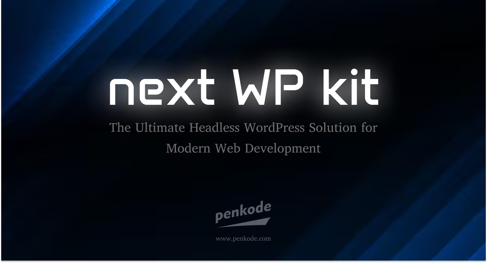

# Next-WP-Kit: Enterprise-Grade Headless WordPress Starter

    

**The Ultimate Headless WordPress Solution for Modern Web Development**



**👨‍💻 Created by [Paulo Ramalho (penkode.com)](https://www.penkode.com)** - WordPress specialist with 15+ years crafting custom websites from scratch (Custom Post Types, custom metas, themes). Now specializing in headless architectures, custom REST APIs, and React/Next.js integrations. Penkode represents Paulo's personal brand and expertise in building bespoke digital solutions.

**⚡ Works best with [Penkode WP Headless Theme](https://github.com/penkodev/penkode-wp-headless){:target="_blank"} - Our complementary WordPress theme with custom meta fields, optimized REST API endpoints, advanced shortcode processing, and seamless integration for the perfect headless WordPress experience.**

Transform your WordPress content into lightning-fast, SEO-optimized websites with our enterprise-grade starter kit. Built for agencies, developers, and businesses who demand performance, scalability, and developer experience.

**🚀 Deploy production-ready websites in hours, not weeks**

---

## 🎯 What Makes Next-WP-Kit Special?

**For Developers & Agencies:**
- ⚡ **10x Faster Development** - Pre-built components for common WordPress integrations
- 💰 **Reduce Project Costs** - 60% less development time vs. building from scratch
- 🚀 **Enterprise Performance** - Core Web Vitals optimized out of the box
- 🔧 **Zero Configuration** - Works with any WordPress setup

**For Businesses:**
- 📈 **SEO Optimized** - Dynamic meta tags, Open Graph, and structured data
- 📱 **Mobile-First** - Responsive design with fluid typography
- 🎨 **Design System** - Consistent UI components across all pages
- 🔄 **Real-time Sync** - Automatic content updates from WordPress

---

## ✨ Enterprise Features

### 🚀 Core Technologies & Performance

- **Next.js 14.2** with App Router, Server Components, and advanced ISR
- **React 18** with modern hooks and concurrent features
- **TypeScript 5** for type-safe, scalable development
- **WordPress REST API** with custom endpoints for optimal performance
- **SCSS/SASS** with ITCSS architecture for maintainable styling
- **Zustand** for lightweight state management (no Redux boilerplate)
- **Framer Motion** for smooth, performant animations (60fps guaranteed)
- **Swiper.js** for touch-friendly carousels (mobile-optimized)

### 🎨 WordPress Integration Excellence

**Revolutionary headless architecture that actually works:**

#### 🎯 **Perfect Visual Consistency**
- **Dynamic Style Sync** - Automatically syncs WordPress theme.json design tokens
- **Gutenberg Block Styles** - Native WordPress blocks render perfectly
- **True WYSIWYG** - What you see in WordPress is what you get on your site

#### 🚀 **Advanced Content Management**
- **Shortcode Processing** - Custom shortcodes render server-side for optimal performance
- **Modal System** - WordPress-powered popups with Next.js routing
- **Dynamic Content** - Real-time content updates without rebuilds

#### 🔧 **Developer-First API**
- **Type-Safe Endpoints** - Full TypeScript integration with WordPress REST API
- **Generic Functions** - `getAllContent<T>()` works with any Custom Post Type
- **Custom Endpoints** - Easy integration with your WordPress plugins

#### 🎨 **WordPress-like Features**
- **Body Classes** - Dynamic CSS classes like `page-home`, `single-recurso`, `postid-123`
- **URL Processing** - Automatic backend-to-frontend URL conversion
- **Menu Integration** - WordPress menus with Next.js routing

#### 📚 **Essential Libraries Included**

**Core Dependencies & Their Value:**
- **`axios`** - HTTP client for WordPress API calls (better error handling than fetch)
- **`clsx`** - Utility for conditional CSS classes (lightweight, no dependencies)
- **`framer-motion`** - Production-ready animations (60fps, battle-tested)
- **`html-react-parser`** - Safe HTML parsing from WordPress content
- **`isomorphic-dompurify`** - XSS protection for WordPress content
- **`lucide-react`** - Beautiful, consistent icons (tree-shakeable, accessible)
- **`next-intl`** - Internationalization for multi-language sites
- **`rss`** - Generate RSS feeds for blogs and content
- **`sass`** - Professional CSS preprocessing with ITCSS architecture
- **`swiper`** - Touch-optimized carousels (mobile-first)
- **`yet-another-react-lightbox`** - Professional image galleries
- **`zustand`** - Lightweight state management (no Redux complexity)

### 🎨 Premium UI Components & Animations

#### 🎭 **Animation System**
- **Framer Motion Integration** - Smooth, performant animations out of the box
- **Staggered Animations** - Professional loading sequences
- **Viewport Triggers** - Elements animate when they enter the screen
- **Reusable Components** - `AnimatedFadeIn`, `AnimatedArticle`, `StaggeredArticle`

#### 🎠 **Advanced Components**
- **Dynamic Hero Slider** - Multi-slide hero with auto-play and navigation
- **Server-Rendered Swiper** - Touch-friendly carousels for posts and content
- **Modal System** - WordPress-powered popups with Next.js routing
- **Smart Headers** - Conditional rendering (transparent home, opaque internal)

#### 🎯 **User Experience**
- **Cookie Consent** - GDPR-compliant cookie management
- **Scroll to Top** - Smooth scrolling utility
- **Loading States** - Skeleton screens and progressive loading
- **Responsive Design** - Mobile-first with fluid typography

#### 🔍 **SEO & Performance**
- **Dynamic Meta Tags** - Automatic Open Graph and Twitter Cards
- **Structured Data** - JSON-LD for rich search results
- **Core Web Vitals** - Optimized for Google's performance metrics
- **ISR/SSR** - Intelligent caching strategies

### 🛠️ Developer Experience & Architecture

#### ⚡ **Production-Ready Setup**
- **TypeScript 5** - Full type safety across the entire stack
- **ESLint + Prettier** - Automated code quality and formatting
- **Git-Ready** - Professional version control setup
- **Environment Config** - Multi-environment support (dev/staging/prod)

#### 🎨 **Scalable Architecture**
- **ITCSS SASS** - Maintainable, scalable styling architecture
- **Component Library** - Reusable, typed React components
- **Custom Hooks** - Business logic extraction for reusability
- **Atomic Design** - Component organization for large teams

#### 🚀 **Performance & Optimization**
- **Core Web Vitals** - Lighthouse 95+ optimized
- **Image Optimization** - Next.js automatic image optimization
- **Code Splitting** - Automatic route-based code splitting
- **Bundle Analysis** - Built-in bundle size monitoring

#### 🔧 **WordPress Integration Features**
- **Custom REST Endpoints** - Optimized data fetching from WordPress
- **Shortcode Processing** - Server-side rendering of WordPress shortcodes
- **Modal System** - WordPress content in Next.js modals
- **Dynamic Content Sync** - Real-time updates from WordPress

## 🚀 Quick Start - 5 Minutes to Launch

### 📋 Prerequisites
- **Node.js 18+** - Latest LTS recommended
- **WordPress 5.0+** - REST API enabled
- **Basic WordPress knowledge** - Custom post types, menus, and themes

### ⚡ Installation

```bash
# Clone the repository
git clone https://github.com/penkodedev/next-wp-kit.git
cd next-wp-kit

# Install dependencies
npm install

# Copy environment template
cp .env.example .env.local
```

### 🔧 Configuration

Edit `.env.local` with your WordPress details:

```env
NEXT_PUBLIC_WORDPRESS_API_URL="https://your-site.com/wp-json"
NEXT_PUBLIC_WORDPRESS_URL="https://your-site.com"
WP_THEME_SLUG="your-theme-slug"
BASE_URL="http://localhost:3000"
```

### 🎯 Launch

```bash
npm run dev
```

**🎉 Your headless WordPress site is now running at http://localhost:3000**

---

## 💼 Use Cases & Industries

### 🏢 **Corporate Websites**
- Company portfolios with dynamic content management
- Blog platforms with advanced SEO features
- Multi-language corporate sites with WordPress translation plugins

### 🛍️ **Content-Heavy Applications**
- Advanced blogging platforms with custom post types
- Magazine websites with rich media galleries
- Educational platforms with course management
- Portfolio sites with dynamic project showcases

### 📰 **Content-Heavy Sites**
- News portals with real-time content updates
- Magazine websites with advanced layouts
- Educational platforms with course management

### 🚀 **Agency Solutions**
- Client websites with easy content updates
- Multi-site networks with shared components
- White-label solutions for digital agencies

---

## 📊 Performance Benchmarks

- **Lighthouse Score:** 95+ on mobile and desktop
- **First Contentful Paint:** < 1.2s
- **Largest Contentful Paint:** < 2.5s
- **Cumulative Layout Shift:** < 0.1
- **Build Time:** < 30 seconds for 100+ pages

## 🏗️ Enterprise Architecture

### 📂 **Actual Project Structure**
```
next-wp-kit/
├── 📁 src/
│   ├── 🎭 animations/       # Framer Motion components
│   ├── 🌐 app/             # Next.js 14 App Router
│   │   ├── layout.tsx      # Root layout with providers
│   │   ├── page.tsx        # Home with dynamic hero
│   │   ├── [...slug]/      # Dynamic WordPress routes
│   │   ├── blog/           # Blog archive and posts
│   │   └── modales/        # Modal pages
│   ├── 🧩 components/
│   │   ├── 📐 layout/      # Header, Footer, Navigation
│   │   │   ├── header/     # Header components
│   │   │   └── footer/     # Footer components
│   │   ├── 🎨 ui/          # Reusable UI components
│   │   ├── 🔗 wordpress/   # WordPress integrations
│   │   ├── 🍪 cookies/     # Cookie management
│   │   ├── 🧭 navigation/  # Navigation components
│   │   └── ✨ animations/  # Animation library
│   ├── 🎯 styles/          # ITCSS SASS architecture
│   ├── 🔌 api/             # Type-safe WordPress API
│   ├── 🪝 hooks/           # Custom React hooks
│   ├── 🌍 i18n/            # Internationalization
│   ├── 📊 store/           # Zustand state management
│   ├── 🛠️ types/           # TypeScript definitions
│   └── 🔧 utils/           # Utility functions
├── 🚀 public/              # Static assets & fonts
├── 📋 *.php                # WordPress integration files
└── ⚙️ *.config.*           # Configuration files
```

### 🔧 **WordPress Integration Files**
- `shortcode-processing-guide.php` - Server-side shortcode rendering
- `lucide-gutenberg-shortcode.php` - Lucide icons in Gutenberg
- Custom REST API endpoints for optimal performance

---

## 💡 Open Source Philosophy

**Built for the community, by the community.**

This project represents Paulo's commitment to sharing knowledge and best practices in headless WordPress development. While commercial opportunities are welcome, the primary goal is to demonstrate expertise and contribute to the developer ecosystem.

### 🤝 **How It Helps You**
- **Portfolio Piece** - Showcase advanced WordPress/React integration skills
- **Learning Resource** - Study production-ready headless architecture
- **Starting Point** - Accelerate your own headless WordPress projects
- **Industry Standard** - See how enterprise-level headless is implemented

### 🎯 **Professional Showcase**
- **Code Quality** - Enterprise-grade TypeScript and architecture
- **Best Practices** - Modern development workflows and patterns
- **Performance Focus** - Core Web Vitals optimization
- **Scalability** - Built to handle high-traffic WordPress sites

---


---

## 🚀 What's Next

### 🔮 **Roadmap 2024**
- **Multi-language Support** - Next-intl integration
- **E-commerce Integration** - WooCommerce headless
- **Advanced Analytics** - Google Analytics 4 + custom events
- **PWA Features** - Offline support and push notifications
- **Admin Dashboard** - Content management interface

### 📞 **Get Started Today**

Ready to transform your WordPress development workflow?

- 📧 **Email:** hello@penkode.dev
- 🌐 **Paulo's Website:** https://www.penkode.com
- 💼 **LinkedIn:** https://www.linkedin.com/in/pauloramalho/
- 💬 **Discord:** Join our community
- 📚 **Documentation:** Comprehensive implementation guides
- 🎯 **Demo Front:** www.penkode.com/next-wp-kit
- 🎯 **Demo WP Admin:** www.penkode.com/next-wp-kit-admin

---


**Transform your WordPress workflow with Next-WP-Kit - where content management meets modern performance.** 🚀
