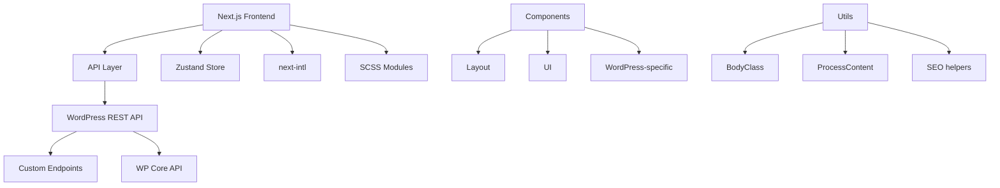

# RECOMENDACIONES PARA NEXT-WP-KIT

## 📋 Estado Actual del Proyecto

Basado en el análisis del código y estructura del proyecto next-wp-kit, aquí están las recomendaciones organizadas por categorías.

## 🏗️ Arquitectura y Estructura

### ✅ Fortalezas Identificadas
- **Arquitectura Next.js 14 con App Router**: Bien implementado con Server Components
- **Separación clara de responsabilidades**: API, componentes, tipos, y utilidades bien organizados
- **Sistema de tipos TypeScript robusto**: Interfaces bien definidas para WordPress y componentes
- **Integración headless WordPress**: API client centralizado y tipado
- **Internacionalización**: Configurado con next-intl
- **Gestión de estado**: Zustand para modales y estado global

### 🔧 Áreas de Mejora

#### 1. **Optimización de Rendimiento**
- **Implementar ISR/SSR más granular**: Actualmente usa revalidate: 3600 globalmente. Considerar estrategias por tipo de contenido
- **Lazy loading de componentes**: Algunos componentes pesados podrían beneficiarse de lazy loading
- **Optimización de imágenes**: Implementar next/image con tamaños responsivos
- **Code splitting**: Dividir bundles por rutas o funcionalidades

#### 2. **Seguridad**
- **Validación de entrada**: Añadir validación más estricta en el cliente API
- **Rate limiting**: Implementar límites en las llamadas API
- **Sanitización de contenido**: Mejorar la sanitización HTML de WordPress
- **Variables de entorno**: Mejor gestión de secrets y configuración

#### 3. **SEO y Performance**
- **Meta tags dinámicos**: Expandir generateMetadata para más páginas
- **Schema markup**: Añadir datos estructurados JSON-LD
- **Sitemap dinámico**: Mejorar generación automática
- **Open Graph images**: Generación automática de imágenes sociales

## 🔄 Mejores Prácticas Recomendadas

### API Layer
```typescript
// Recomendación: Implementar un sistema de cache más sofisticado
interface CacheConfig {
  ttl: number;
  strategy: 'memory' | 'redis' | 'filesystem';
}

// Recomendación: Añadir retry logic con exponential backoff
async function fetchWithRetry<T>(
  url: string,
  options: RequestInit,
  maxRetries: number = 3
): Promise<T> {
  // Implementation with retry logic
}
```

### Component Architecture
- **Atomic Design**: Considerar implementar patrón de diseño atómico
- **Compound Components**: Para componentes complejos como sliders y modales
- **Custom Hooks**: Extraer lógica de componentes a hooks reutilizables

### Error Handling
```typescript
// Recomendación: Sistema de error handling centralizado
interface AppError {
  code: string;
  message: string;
  statusCode: number;
  timestamp: Date;
}

class ErrorHandler {
  static handle(error: unknown): AppError {
    // Centralized error processing
  }
}
```

## 📊 Diagrama de Arquitectura Actual



## 🚀 Roadmap de Mejoras

### Fase 1: Optimización Básica
- [ ] Implementar React Query/SWR para cache inteligente
- [ ] Añadir error boundaries
- [ ] Mejorar loading states
- [ ] Implementar service worker básico

### Fase 2: Rendimiento Avanzado
- [ ] CDN configuration
- [ ] Image optimization pipeline
- [ ] Bundle analysis y optimización
- [ ] PWA capabilities

### Fase 3: Escalabilidad
- [ ] Micro-frontends consideration
- [ ] Advanced caching strategies
- [ ] Monitoring y analytics
- [ ] A/B testing framework

## 🔍 Problemas Potenciales Identificados

1. **Dependencias**: Algunas dependencias podrían estar desactualizadas
2. **Configuración**: Variables de entorno podrían necesitar validación
3. **Testing**: Falta suite de tests completa
4. **Documentación**: README podría expandirse con guías de troubleshooting

## 💡 Recomendaciones Específicas

### Para Desarrollo
- Implementar Husky para pre-commit hooks
- Añadir Storybook para desarrollo de componentes
- Configurar testing con Jest + React Testing Library

### Para Producción
- Configurar monitoring con Sentry
- Implementar logging estructurado
- Añadir health checks
- Configurar CI/CD pipeline

### Para Mantenimiento
- Actualizar dependencias regularmente
- Implementar semantic versioning
- Documentar breaking changes
- Crear runbooks para deployments

---

*Estas recomendaciones se basan en el análisis del código actual y mejores prácticas de la industria para aplicaciones Next.js + WordPress headless.*


 Plan para CPT Hero dinámico:
📊 Situación actual:
HeroConfig.tsx tiene slides hardcodeados
Es perfecto para desarrollo rápido y testing
Fácil de modificar manualmente
🔄 Cuando tengas CPT Hero:
1. Crear API endpoint en WordPress:
// En functions.php o plugin custom
add_action('rest_api_init', function () {
    register_rest_route('custom/v1', '/heroes', array(
        'methods' => 'GET',
        'callback' => 'get_hero_slides',
        'permission_callback' => '__return_true',
    ));
});
2. Función que obtiene slides del CPT:
function get_hero_slides() {
    $args = array(
        'post_type' => 'hero',
        'posts_per_page' => -1,
        'orderby' => 'menu_order',
        'order' => 'ASC'
    );
    
    $slides = array();
    $query = new WP_Query($args);
    
    while ($query->have_posts()) {
        $query->the_post();
        $slides[] = array(
            'title' => get_the_title(),
            'subtitle' => get_field('subtitle'), // ACF field
            'buttonText' => get_field('button_text'),
            'buttonLink' => get_field('button_link'),
            'backgroundType' => get_field('background_type'),
            'backgroundImage' => get_field('background_image'),
        );
    }
    
    return $slides;
}
3. Modificar HeroConfig para ser dinámico:
// HeroConfig.tsx - versión futura
export const heroSlides = await fetchHeroSlides(); // De WordPress API

async function fetchHeroSlides(): Promise<HeroSlide[]> {
  try {
    const response = await fetch('/wp-json/custom/v1/heroes');
    return await response.json();
  } catch (error) {
    // Fallback a slides por defecto
    return defaultSlides;
  }
}
4. Arquitectura híbrida:
Desarrollo: Usar slides hardcodeados (como ahora)
Producción: Cargar dinámicamente desde WordPress
Fallback: Si falla la API, usar slides por defecto
🎨 Campos ACF para CPT Hero:
titulo (text)
subtitulo (textarea)
texto_boton (text)
enlace_boton (url)
tipo_fondo (select: gradient/image/video)
imagen_fondo (image)
video_fondo (file)
orden (number para menu_order)
🔧 Ventajas del approach:
✅ Contenido editable desde WordPress admin
✅ Múltiples heroes para diferentes páginas
✅ Fallback automático si hay problemas
✅ Mantiene animaciones y configuraciones actuales